# [Task 3] String search
Navigate to the path `C:\Users\Administrator\Desktop\mal`, then execute the command to check the malicious string in these 3 samples: <br>
```
floss --no-static-strings C:\Users\Administrator\Desktop\mal\2
floss --no-static-strings C:\Users\Administrator\Desktop\mal\5
floss --no-static-strings C:\Users\Administrator\Desktop\mal\6
```
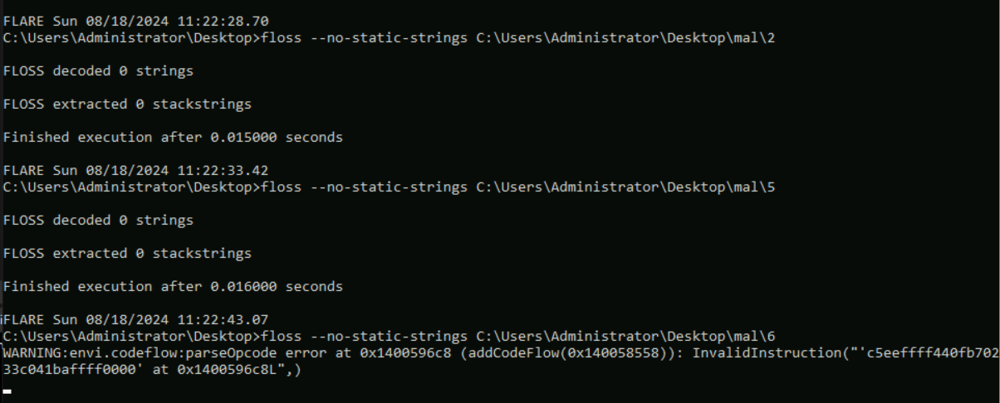 <br>
Apparently, the sample 6 contains the string `DbgView.exe`. <br>
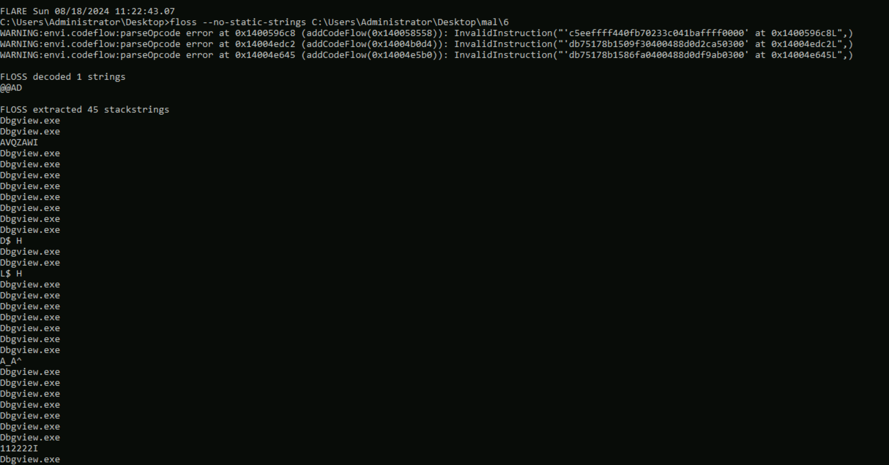 <br>

## Q1. On the Desktop in the attached VM, there is a directory named 'mal' with malware samples 1 to 6. Use floss to identify obfuscated strings found in the samples named 2, 5, and 6. Which of these samples contains the string 'DbgView.exe'?
```
6
```

# [Task 4] Fingerprinting malware
- When analyzing malware, it is often required to identify unique malware and differentiate them from each other. File names can't be used for this purpose as they can be duplicated easily and might be confusing. Also, a file name can be changed easily as well. An image of a bug identifying itself using its fingerprint on a fingerprint machineHence, a hash function is used to identify a malware sample uniquely. 
- A hash function takes a file/data of arbitrary length as input and creates a fixed-length unique output based on file contents. This process is irreversible, as you can't recreate the file's contents using the hash. Hash functions have a very low probability (practically zero) of two files having different content but the same hash. A hash remains the same as long as the file's content remains the same. However, **even a slight change in content will result in a different hash**. It might be noted that the file name is not a part of the content; therefore, changing the file name does not affect the hash of a file.
- Besides identifying files, hashes are also used to store passwords to authenticate users. In malware analysis, hash files can be used to identify unique malware, search for this malware in different malware repositories and databases, and as an **Indicator of Compromise (IOC)**. 

## Commonly used methods of calculating File hashes:
For identification of files, a hash of the complete file is taken. There are various methods to take the hash. The most commonly used methods are:

- Md5sum
- Sha1sum
- Sha256sum

The first two types of hashes are now considered insecure or prone to collision attacks (when two or more inputs result in the same hash). Although a collision attack for these hash functions is not very probable, it is still possible. Therefore, sha256sum is currently considered the most secure method of calculating a file hash. In the attached VM, we can see that multiple utilities calculate file hashes for us.

## Finding Similar files using hashes:
Another scenario in which hash functions help a malware analyst is identifying **similar** files using hashes. We already established that even a slight change in the contents of a file would result in a different hash. However, some types of hashes can help identify the similarity among different files. Let's learn about some of these.

### Imphash:
The `imphash` stands for "import hash". Imports are functions that an executable file imports from other files or `Dynamically Linked Libraries (DLLs)`. The `imphash` is a hash of the function calls/libraries that a malware sample imports and the order in which these libraries are present in the sample. This helps identify samples from the same threat groups or performing similar activities. More details on the `Imphash` can be found on Mandiant's blog here.

We can use PEstudio to calculate the `Imphash` of a sample. 

### Fuzzy hashes/SSDEEP:
Another way to identify similar malware is through fuzzy hashes. A fuzzy hash is a `Context Triggered Piecewise Hash (CTPH)`. This hash is calculated by dividing a file into pieces and calculating the hashes of the different pieces. This method creates multiple inputs with similar sequences of bytes, even though the whole file might be different. More information on `SSDEEP` can be found on this link.

Multiple utilities can be used in the attached VM to calculate `ssdeep`, like CyberChef. However, the `ssdeep` utility has been placed on the Desktop to make it easier. The following command shows the help menu of the utility.

In [Malware Bazaar](https://bazaar.abuse.ch/browse.php?search=imphash%3A756fdea446bc618b4804509775306c0d), all these samples have the same imphash. We can see that all of these samples are classified as the same malware family. We can see that their sha256 hash is vastly different and doesn't provide any information as to their similarity. However, the same imphash helps us identify that they might belong to the same family.


### Q1. In the samples located at Desktop\mal\ directory in the attached VM, which of the samples has the same imphash as file 3?

Use this command: <br>
```
ssdeep-2.14.1\ssdeep.exe mal\* 
```
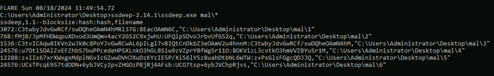 <br>

```
1
```

### Q2. Using the ssdeep utility, what is the percentage match of the above-mentioned files?
Use this command: <br>
```
ssdeep-2.14.1\ssdeep -l -r -d mal\*
```
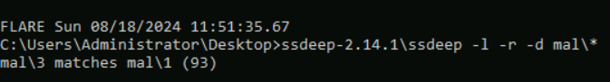 <br>
```
93
```

# [Task 5] Signature-based detection
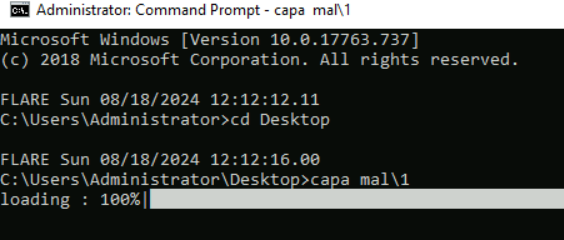 <br>
Use this command of `capa`. As we see, `capa` has mapped the identified capabilities according to the `MITRE ATT&CK` framework. <br>
```
capa mal\1
```
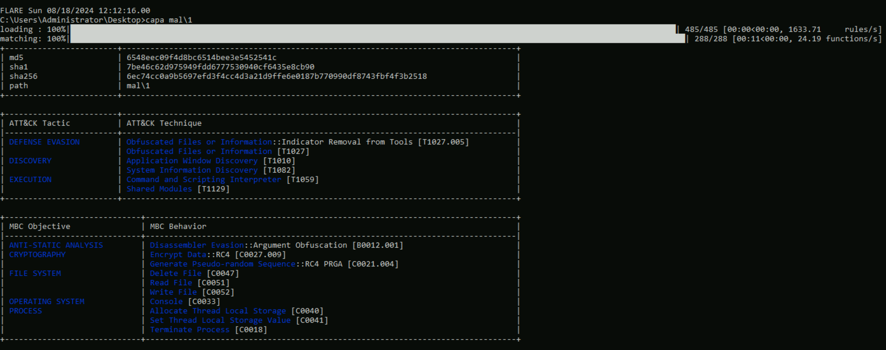 <br>
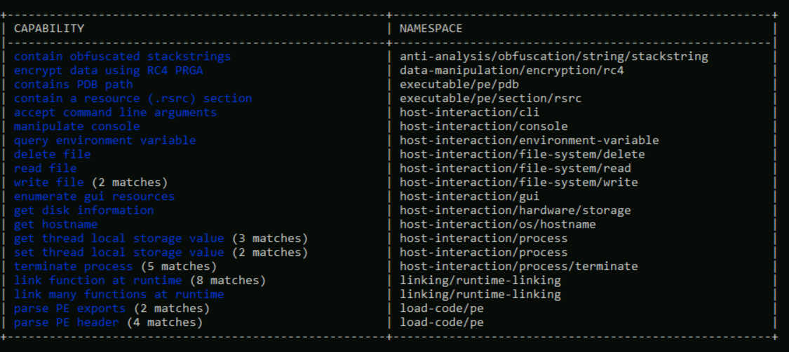 <br>


Now let's use capa to analyse the file Desktop\mal\4 and answer the following questions. <br>
```
capa mal\4
```
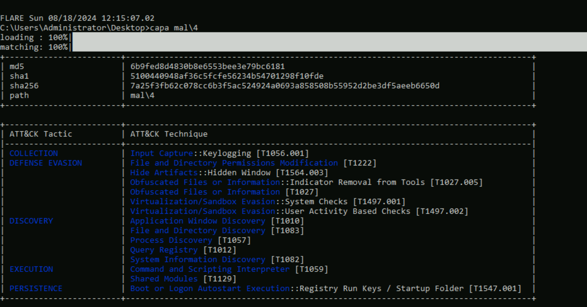 <br>


### Q1. How many matches for anti-VM execution techniques were identified in the sample?
```
86
```
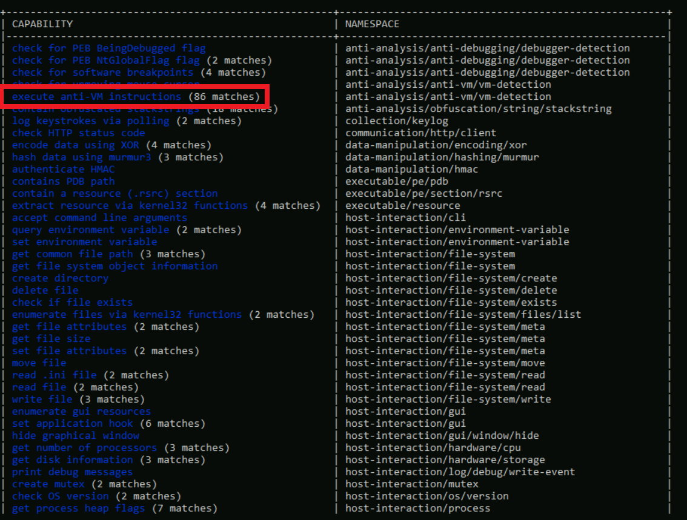 <br>

### Q2. Does the sample have to capability to suspend or resume a thread? Answer with Y for yes and N for no.
```
Y
```
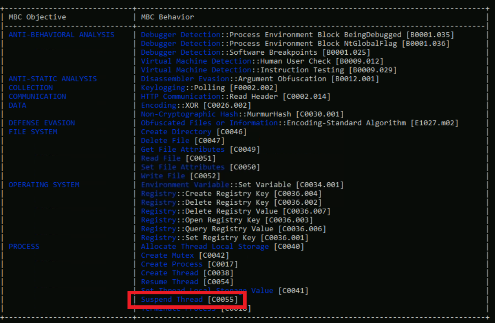 <br>


### Q3. What MBC behavior is observed against the MBC Objective 'Anti-Static Analysis'?
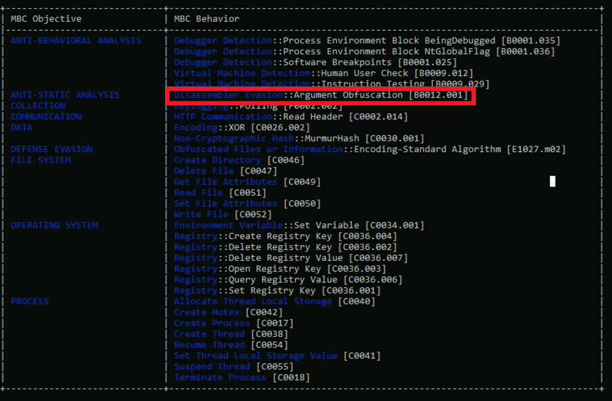 <br>

```
Disassembler Evasion::Argument Obfuscation [B0012.001]
```


### Q4. At what address is the function that has the capability 'Check HTTP Status Code'?
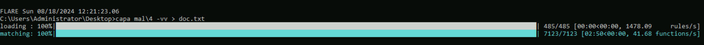 <br>

```
capa mal\4 -vv > doc.txt
```
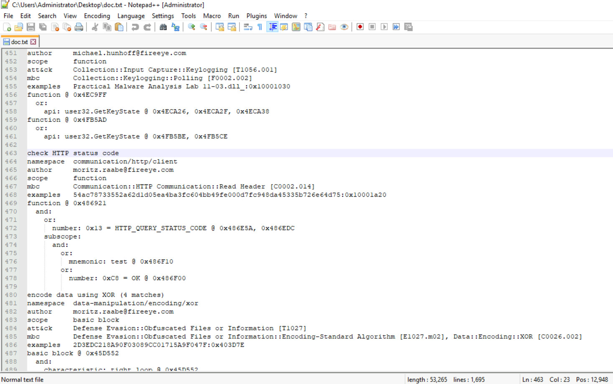 <br>
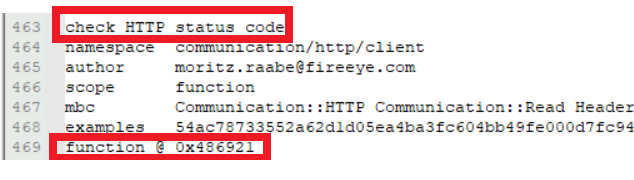 <br>

#### Answer
```
0x486921
```
# [Task 6] Leveraging the PE header
## The PE header:
- The programs that we run are generally stored in the executable file format. These files are portable because they can be taken to any system with the same Operating System and dependencies, and they will perform the same task on that system. Therefore, these files are called `Portable Executables (PE files)`. The `PE` files consist of a sequence of bits stored on the disk. This sequence is in a specific format. The initial bits define the characteristics of the `PE` file and explain how to read the rest of the data. This initial part of the `PE` file is called a `PE` header. 
- Several tools in the `FLARE VM` can help us analyze `PE` headers. `PEStudio` is one of them. We already familiarized ourselves with `PEStudio` in a previous task, so we will just use that in this task as well.
- The `PE` header contains rich information useful for malware analysis

## Linked Libraries, imports, and functions:
- A `PE` file does not contain all of its code to perform all the tasks. It often reuses code from libraries, often provided by Microsoft as part of the Windows Operating System. Often, certain functions from these libraries are imported by the `PE` file. The `PE` header contains information about the libraries that a `PE` file uses and the functions it imports from those libraries. This information is very useful. A malware analyst can look at the libraries and functions that a `PE` file imports and get a rough idea of the functionality of a malware sample. For example, if a malware sample imports the CreateProcessA function, we can assume that this sample will create a new process.
- Similarly, other functions can provide further information about the sample. However, it must be noticed that we don't know the context in which these functions are called by just looking at the `PE` headers. We need to dig deeper into that, which we will cover in the upcoming rooms.
- `PEStudio` has a libraries option in the right pane, which, when selected, shows us the libraries that a `PE` file will use.

### Path to `PEStudio`
```
C:\ProgramData\Microsoft\Windows\Start Menu\Programs\FLARE\Utilities
```
## Q1. Open the sample ` Desktop\mal\4` in `PEstudio`. Which library is blacklisted?
```
rpcrt4.dll
```
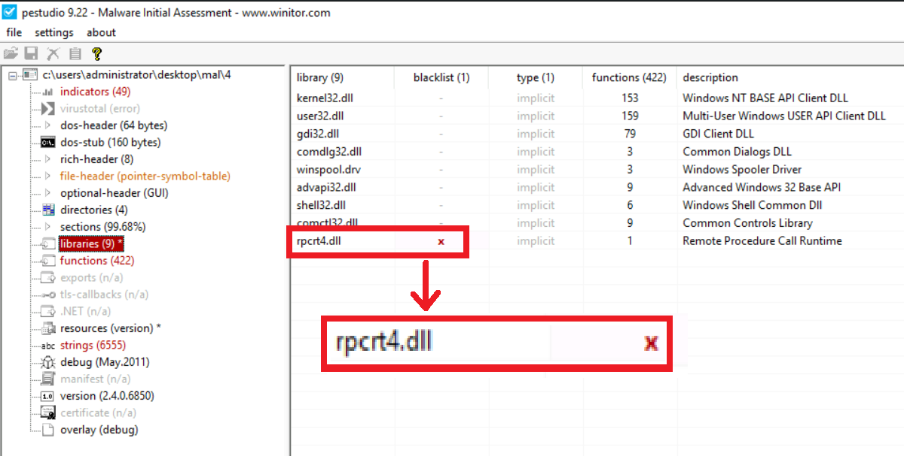 <br>

## Q2. What does this `dll` do?


```
Remote Procedure Call Runtime
```
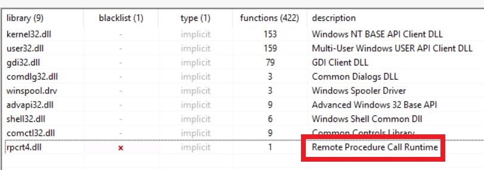 <br>
---
# References
- [THM - Basic Static Analysis](https://tryhackme.com/r/room/staticanalysis1)
- [TRY HACK ME: Basic Static Analysis Write-Up](https://medium.com/@kumarishefu.4507/try-hack-me-basic-static-analysis-write-up-500b0e23792d) by Shefali Kumari, 2023.