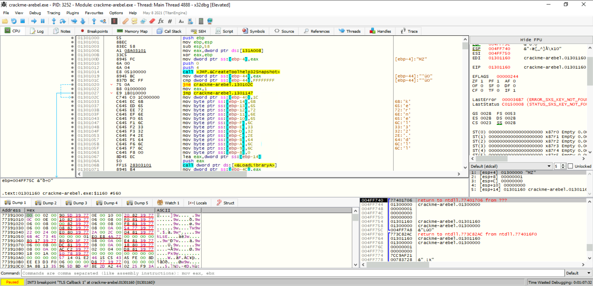
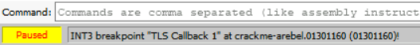

Analyzing malware is like a cat-and-mouse game. Malware analysts keep devising new techniques to analyse malware, while malware authors devise new techniques to evade detection. This task will review some techniques that hamper our efforts to analyse malware using static or basic dynamic analysis.

## Evasion of Static Analysis:
In the static analysis rooms, we learned techniques to perform static analysis on malware. Malware often hides or tries to look like legitimate software to evade the prying eyes of a malware analyst. Because we are not executing the malware during static analysis, the main focus of evading static analysis is to obfuscate the true functionality of the program until the program is executed. The following techniques can be commonly used to achieve this.An image showing a magnifying glass focused on a  computer screen, where a bug is trying to hide behind a folder.

- **Changing the hash:** We have learned previously that every file has a unique hash. Malware authors exploit this functionality by slightly changing their malware. This way, the malware's hash changes, bypassing the hash-based detection mechanism. Hashes can change even if one bit of the malware is changed (unless we are talking Context-Triggered Piecewise Hashes or fuzzy hashes), so just adding a NOP instruction or other such change can defeat the hash-based detection techniques.
-** Defeating AV signatures:** Anti-virus signatures and other signature-based detection often depend on static patterns found inside malware. Malware authors change those patterns to try to evade signatures. This technique is often accompanied by general obfuscation of malware code.
- **Obfuscation of strings:** Some malware authors obfuscate the strings in malware by decoding them at runtime. When we search the malware for strings, we might find nothing useful. However, when the malware runs, it decodes those strings during execution. Malware authors might obfuscate important strings, such as URLs, C2 domains, etc., to avoid burning the infrastructure based on a single-string search.
- **Runtime loading of DLLs:** Since we can identify malware imports while analyzing PE headers, malware authors often use the Windows libraries' LoadLibrary or LoadLibraryEx to load a DLL at runtime. When analyzing this malware statically, we might not see all the functions it is linked to while analyzing its headers.
- **Packing and Obfuscation:** Packing is very popular amongst malware authors. Packing malware is like packing a present. When we look at a packed present, we can't say what might be inside it unless we unpack the wrapper and take out the present. Similarly, packers pack the malware in a wrapper by writing code that decodes the malware at runtime. So when performing static analysis, we might be unable to see what is inside the packer. However, when we execute the malware, it unpacks the code, loads the actual malicious code into the memory, and then executes it. 
As we might have observed, most of these techniques are suitable for hiding in plain sight, but they can be defeated when the malware is executed while performing dynamic analysis.

## Evasion of Basic Dynamic Analysis:
Malware authors do not just accept their fate and let dynamic analysis detect their samples. For evasion of dynamic analysis, a host of techniques are employed. These techniques generally depend on identifying whether the malware runs in a controlled analysis environment. The following techniques are commonly used for this purpose:

- **Identification of VMs:** Though some of these techniques might backfire nowadays since a lot of enterprise infrastructure is hosted on VMs, one of the favourites of malware authors has been to identify if the malware is running inside a VM. For this, malware often checks for registry keys or device drivers associated with popular virtualization software such as VMWare and Virtualbox. Similarly, minimal resources, such as a single CPU and limited RAM, might indicate that the malware is running inside a VM. In this scenario, malware will take a different execution path that is not malicious to fool the analyst.
- **Timing attacks:** Malware will often try to time out automated analysis systems. For example, when malware is executed, it will try to sleep for a day using the Windows Sleep library. After a few minutes, the automated analysis system will shut down, finding no traces of malicious activity. Newer malware analysis systems can identify these attacks and try to mitigate them by shortening the time the malware sleeps. However, malware can identify those mitigations by performing targeted timing checks to see if the time is being manipulated. This can be done by noting the time of execution and comparing it with the current time after the execution of the sleep call. 
- **Traces of user activity:** Malware tries to identify if there are traces of user activity in the machine. If no or very few traces are found, malware will decide that it is being executed inside a controlled system and take a different, benign execution path. Traces of user activity can include no mouse or keyboard movement, lack of browser history, no recently opened files, little system uptime, etc. 
- **Identification of analysis tools:** Malware can ask the Windows OS for a running process list using `Process32First`, `Process32Next`, or similar functions. If popular monitoring tools are identified among the list of running processes, malware can take a benign execution path. For example, if `ProcMon` or `ProcExp` is running, malware can identify that and switch to benign activities. Another way to identify analysis tools is by looking at the names of different windows open in a system. If the malware finds `Ollydbg` or `ProcMon` in the open Windows, it can switch to a different execution path.

By employing these techniques, malware authors make it difficult for malware analysts to perform analysis. However, malware analysts can use some tools and techniques to take greater control.

# [Task 3] Introduction to Debugging
The term Debugging is widely used by software programmers to identify and fix bugs in a program. Similarly, a malware sample trying to evade detection or reverse engineering can also be considered a program having a bug. A malware reverse engineer often has to debug a program to remove any roadblocks that prevent it from performing its malicious activity. Therefore, interactive debugging becomes an essential part of advanced malware analysis. Debuggers provide a malware analyst with the control desired to monitor a running program more closely, looking at the changes in different registers, variables, and memory regions as each instruction is executed. A debugger also allows a malware analyst to change the variables' values to control the program's flow at runtime, providing greater control over the execution path the malware follows.An image showing a person looking at a computer screen with a magnifying glass in one hand and a surgical tool in another, trying to remove a bug. The image depicts the act of removing the bug, i.e. de-bugging the computer

## Types of Debuggers:
We can loosely categorize debuggers into one of the following three categories.

### Source-Level Debuggers:
Source Level Debuggers work on the source code level. Most software programmers use source-level debuggers while writing code to check their code for bugs. A source-level debugger is a high-level debugger compared to the other two options. When using a source-level debugger, we often see the local variables and their values.

### Assembly-Level Debuggers:
When a program has been compiled, its source code is lost and can't be recovered. This is the case with malware analysis. We don't have the malware's source code we are investigating; instead, we have a compiled binary. An assembly-level debugger can help us debug compiled programs at the assembly level. While debugging with an assembly-level debugger, we often see the CPU registers' values and the debuggee's memory. This is the most common type of debugger used for malware reverse engineering. The debugger attaches to the program that has to be debugged and executes it as per the analyst's desire.

### Kernel-Level Debuggers:
Kernel-level debuggers are a step even lower than assembly-level debuggers. As the name suggests, these debuggers debug a program at the Kernel Level. For this level of debugging, generally, two systems are required. One system is used for debugging the code running on the other system. This is because if the kernel is stopped using a breakpoint, the whole system will stop.

Now let's move to the next task to learn how to debug malware.

# [Task 5] Debugging in Practice
Since `TLS callbacks` are often used as an anti-reverse engineering technique, we should be careful when navigating this `TLS callback`. Therefore, it will be prudent to single-step each instruction while we are in the callback.  We can do that by clicking the step-into option we discussed above. After stepping into every instruction, we see the EIP moving to the next instruction, and the values in the registers and stack change accordingly. After stepping in a few instructions, we reach a conditional jump instruction. In the pane below the disassembly, we can see that the debugger tells us that the jump is not taken. The registers pane shows that the ZF is set, so the jump is not taken. 

  
  

# Reference
- [Dynamic Analysis: Debugging](https://tryhackme.com/r/room/advanceddynamicanalysis)
