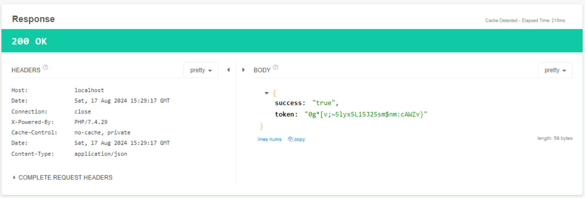
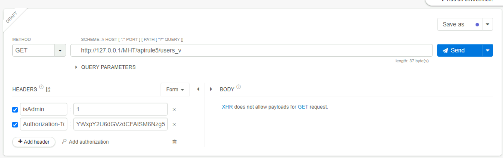

# [Task 3] Vulnerability I - Broken Object Level Authorisation (BOLA)
- What is the issue with the above `API call`? The problem is that the endpoint is not validating any incoming API call to confirm whether the request is valid. It is not checking for any authorisation whether the person requesting the `API call` can ask for it or not.
- The solution for this problem is pretty simple; Bob will implement an **authorisation mechanism** through which he can identify who can make `API calls` to access employee ID information.
- The purpose is achieved through access tokens or authorisation tokens in the header. In the above example, Bob will add an authorisation token so that only headers with valid authorisation tokens can make a call to this endpoint.
- In the VM, if you add a valid **Authorization-Token** and call http://localhost:80/MHT/apirule1_s/user/1, only then will you be able to get the correct results. Moreover, all API calls with an invalid token will show `403 Forbidden` an error message (as shown below).

### Practice API Call Example
```
http://localhost:80/MHT/apirule1_v/user/1
```
 <br>
 <br>


### Q1. Suppose the employee ID is an integer with incrementing value. Can you check through the vulnerable API endpoint the total number of employees in the company?
```
3
```
### Q2. What is the flag associated with employee ID 2?

 <br>
 <br>

```
http://localhost:80/MHT/apirule1_v/user/2
THM{838123}
```


### Q3. What is the username of employee ID 3?
 <br>
 <br>
```
Bob
```

# [Task 4] Vulnerability II - Broken User Authentication (BUA)

 <br>
 <br>


## Mitigation Measures 
- Ensure complex passwords with higher entropy for end users.
- Do not expose sensitive credentials in `GET` or `POST` requests.
- Enable strong `JSON Web Tokens (JWT)`, authorisation headers etc.
- Ensure the implementation of multifactor authentication (where possible), account lockout, or a captcha system to mitigate brute force against particular users. 
- Ensure that passwords are not saved in plain text in the database to avoid further account takeover by the attacker. 

### Q1. Can you find the token of hr@mht.com?
 <br>
```
cOC%Aonyis%H)mZ&uJkuI?_W#4&m>Y
```
### Q2. To which country does sales@mht.com belong?
```
China
```
### Q3. Is it a good practice to send a username and password in a GET request (yea/nay)?
```
nay
```

# [Task 5] Vulnerability III - Excessive Data Exposure

## Mitigation Measures 
- **Never** leave sensitive data filtration tasks to the front-end developer. 
- Ensure time-to-time review of the response from the `API` to guarantee it returns only legitimate data and checks if it poses any security issue. 
- Avoid using generic methods such as` to_string()` and `to_json()`. 
- Use `API` endpoint testing through various test cases and verify through automated and manual tests if the `API` leaks additional data.

### Q1. What is the device ID value for post-ID 2?
 <br>
#### API
```
http://localhost:80/MHT/apirule3/comment_v/2
```
#### Answer
```
iOS15.411
```
### Q2. What is the username value for post-ID 3?
### API
```
http://localhost:80/MHT/apirule3/comment_v/3
```
### Answer
```
hacker#!
```


### Q3. Should we use network-level devices for controlling excessive data exposure instead of managing it through APIs (programmatically) - (yea/nay)?
```
nay
```
As [OWASP API Security Project](https://owasp.org/www-project-api-security/) & [Cloudflare - What is API security?](https://www.cloudflare.com/en-gb/learning/security/api/what-is-api-security/) indicated: <br>
- Network-level devices are essential for securing the network perimeter, but they lack the fine-grained control needed to manage excessive data exposure effectively. 
- These devices operate at a high level, often without context or understanding of the specific data or user roles involved. In contrast, managing data exposure through APIs provides detailed, context-aware control over who can access what data and under what conditions.
- APIs allow for better scalability, flexibility, and integration with modern application architectures, making them more suitable for precise data protection and compliance with regulations.

# [Task 6] Vulnerability IV - Lack of Resources & Rate Limiting
### How does it happen?
Lack of resources and rate limiting means that** APIs do not enforce any restriction** on the frequency of clients' requested resources or the files' size, which badly affects the API server performance and leads to the DoS (Denial of Service) or non-availability of service. Consider a scenario where an API limit is not enforced, thus allowing a user (usually an intruder) to upload several GB files simultaneously or make any number of requests per second. Such API endpoints will result in excessive resource utilisation in network, storage, compute etc. <br>

Nowadays, attackers are using such attacks to **ensure the non-availability of service for an organisation**, thus tarnishing the brand reputation through increased downtime. A simple example is non-compliance with the Captcha system on the login form, allowing anyone to make numerous queries to the database through a small script written in Python. <br>

### Q1. Can rate limiting be carried out at the network level through firewall etc. (yea/nay)?

```
yea
```
### Q2. What is the HTTP response code when you send a POST request to /apirule4/sendOTP_s using the email address hr@mht.com?

```
200
```
### Q3. What is the "msg key" value after an HTTP POST request to /apirule4/sendOTP_s using the email address sale@mht.com?

```
Invalid user
```

# [Task 7] Vulnerability V - Broken Function Level Authorisation

## Mitigation Measures 
- Ensure proper design and testing of all authorisation systems and deny all access by default. 
- Ensure that the operations are only allowed to the users belonging to the authorised group. 
- Make sure to review `API` endpoints against flaws regarding functional level authorisation and keep in mind the apps and group hierarchy's business logic. 




### Q1. 
```
+1235322323
```

### Q2. Is it a good practice to send isAdmin value through the hidden fields in form requests - yea/nay? 
```
nay
```

### Q3. What is the address flag of username admin?
```
THM{3432$@#2!}
```

---

# Reference
- [TryHackMe - OWASP API Security Top 10 - 1](https://tryhackme.com/r/room/owaspapisecuritytop105w)
- [Cloudflare - What is API security?](https://www.cloudflare.com/en-gb/learning/security/api/what-is-api-security/)
- [OWASP API Security Project](https://owasp.org/www-project-api-security/)