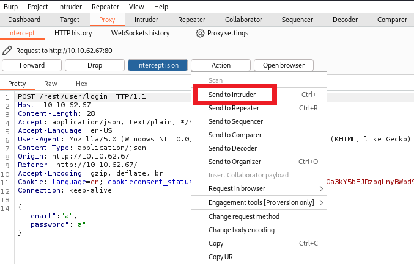

# Setup
- Set Burp and foxyproxy, instructions can be found in this tutorial on Medium [Burp Suite and Foxy Proxy Setup](https://medium.com/@DatBoyBlu3/burp-suite-and-foxy-proxy-setup-67d5c1d86f8c).

# [Task 3] Inject the juice

## Q1. Log into the administrator account!
To log in the account, make sure the `Intercept is on`. <br>
 <br>

After randomly log in with random email and password, Burp receives them all. <br>
 <br>

Modify the emali to `' or 1=1 -- `, then press `forward`. <br>
Then turn off that `Intercept is off.`
 <br>

Now we log in as the admin.
 <br>

The flag is showing up. <br>
 <br>

```
32a5e0f21372bcc1000a6088b93b458e41f0e02a
```

## Q2. Log into the Bender account!
 <br>
 <br>

```
bender@juice-sh.op'-- 
```
### Flag
```
fb364762a3c102b2db932069c0e6b78e738d4066
```

# [Task 4] Who broke my lock?!

## Q1. Bruteforce the Administrator account's password!
Send the request to Intruder. <br>
 <br>

Click on the `Intruder` tab.
 <br>
Select the Clear `§` button. In the password field place two `§` inside the quotes. <br>
 <br>
For payload, we need to install this first. <br>
```bash
apt-get install seclists
```
 <br>

After installtion completed, load the wordlist from the location ` /usr/share/wordlists/SecLists/Passwords/Common-Credentials/best1050.txt`. <br>

 <br>
Then `Start Attack`. <br>
 <br>

Waiting until the attack finished. <br>
 <br>

You can see the progress beneath. <br>
 <br>


---

# Reference
- [TryHackMe : OWASP Juice Shop](https://ex0a.medium.com/tryhackme-owasp-juice-shop-53e87fb1af36) by Emre Alkaya, 2020.
- [Burp Suite and Foxy Proxy Setup](https://medium.com/@DatBoyBlu3/burp-suite-and-foxy-proxy-setup-67d5c1d86f8c) by Daniel Edwards, 2023.
