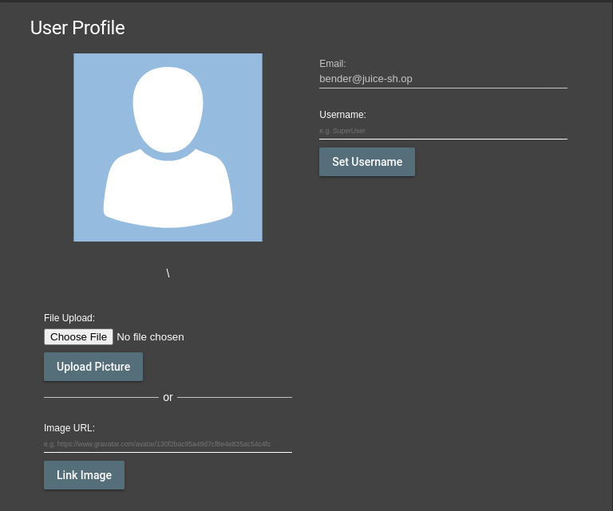
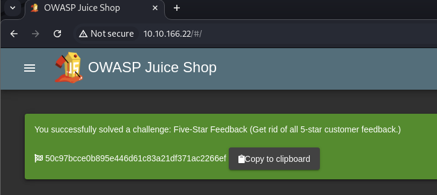

# Setup
- Set Burp and foxyproxy, instructions can be found in this tutorial on Medium [Burp Suite and Foxy Proxy Setup](https://medium.com/@DatBoyBlu3/burp-suite-and-foxy-proxy-setup-67d5c1d86f8c).

# [Task 3] Inject the juice

## Q1. Log into the administrator account!
To log in the account, make sure the `Intercept is on`. <br>
 <br>

After randomly log in with random email and password, Burp receives them all. <br>
 <br>

Modify the emali to `' or 1=1 -- `, then press `forward`. <br>
Then turn off that `Intercept is off.`
 <br>

Now we log in as the admin.
 <br>

The flag is showing up. <br>
 <br>

```
32a5e0f21372bcc1000a6088b93b458e41f0e02a
```

## Q2. Log into the Bender account!
 <br>
 <br>

```
bender@juice-sh.op'-- 
```
### Flag
```
fb364762a3c102b2db932069c0e6b78e738d4066
```

# [Task 4] Who broke my lock?!

## Q1. Bruteforce the Administrator account's password!
Send the request to Intruder. <br>
 <br>

Click on the `Intruder` tab.
 <br>
Select the Clear `§` button. In the password field place two `§` inside the quotes. <br>
 <br>
For payload, we need to install this first. <br>
Email should be: <br>
```
admin@juice-sh.op
```
Install `seclists` for wordlists. <br>
```bash
apt-get install seclists
```
 <br>

After installtion completed, load the wordlist from the location ` /usr/share/wordlists/SecLists/Passwords/Common-Credentials/best1050.txt`. <br>

 <br>
Then `Start Attack`. <br>
 <br>

Waiting until the attack finished. <br>
 <br>

You can see the progress beneath. <br>
 <br>

Find the password. <br>
 <br>

Once you found the password, login and you will get the flag. <br>
 <br>
```
c2110d06dc6f81c67cd8099ff0ba601241f1ac0e
```

## Q2. Reset Jim's password!

### Email
```
jim@juice-sh.op
```
### Security Question
```
Samuel
```
Type any password you like. <br>
 <br>

### Flag
 <br>

# [Task 5] AH! Don't look!
## Q3. Download the Backup file!

```
http://10.10.166.22/ftp/package.json.bak%2500.md
```
 <br>
Add `NULL Poison Byte` which is `%2500` after the downloading URL. <br>
 <br>
 <br>
 <br>

# [Task 6] Who's flying this thing?
## Q1. Access the administration page!
In this case, I use the Chromes browser by Burp. <br>
 <br>
Search for `admin`. Find this one showing the path `administration`. <br>
 <br>
 <br>

## Flag
```
946a799363226a24822008503f5d1324536629a0
```

## Q2. View another user's shopping basket!
Login as an Admin. Before clicking on `Your Basket`, ensure the option is `Intercept is on`, then click the button. <br>
 <br>

Now we get the request, modify the first line into the following: <br>
```
GET /rest/basket/1 HTTP/1.1
```
Press `Forward` the navigate to the browser to see result.
 <br>
This one has on item in the basket. <br>
Let's change UserID to `2`.  We can see an item in the basket now. <br>
 <br>

Turn the option into `Intercept is off`, then navigate back to the home page. Flag will pop up. <br>
 <br>

### Flag
```
41b997a36cc33fbe4f0ba018474e19ae5ce52121
```

## Q3. Remove all 5-star reviews!
Naviaget to the page `http://10.10.166.22/#/administration`, and then delete the 5-star feedback. <br>
 <br>
Well, delete them all works too. <br>

### Flag
```
50c97bcce0b895e446d61c83a21df371ac2266ef 
```
 <br>

# Bonus
## Bonus Payload
 <br>

Insert the XSS DOM in the search bar. <br>
```
<iframe width="100%" height="166" scrolling="no" frameborder="no" allow="autoplay" src="https://w.soundcloud.com/player/?url=https%3A//api.soundcloud.com/tracks/771984076&color=%23ff5500&auto_play=true&hide_related=false&show_comments=true&show_user=true&show_reposts=false&show_teaser=true"></iframe>
```
 <br>

## Exposed Metrics
Navigate to the page `/metrics`. <br>
 <br>

## Missing Encoding
- Go to `/#/photo-wall`. Open inspector (I use Chrome by Burp in this case) or press F12. <br>
 <br>
- Inspect the invalid photo ``. <br>
 <br>


 <br>
You will find the path of this photo. <br>
```
http://<YOUR_MACHINE_IP>/assets/public/images/uploads/%F0%9F%98%BC-#zatschi-#whoneedsfourlegs-1572600969477.jpg
```
 <br>

You can find the encoding character-set for URL in [W3Schools](https://www.w3schools.com/tags/ref_urlencode.ASP). <br>
 <br>

As the question suggested, we have the missing endoing method for this path. Now we just need to change the hashtag(`#`) into the encoding input (`%23`), so it's valid in the URL. <br>

## Answer
```
http://<YOUR_MACHINE_IP>/assets/public/images/uploads/%F0%9F%98%BC-%23zatschi-%23whoneedsfourlegs-1572600969477.jpg
```
 <br>


---

# Reference
- [TryHackMe : OWASP Juice Shop](https://ex0a.medium.com/tryhackme-owasp-juice-shop-53e87fb1af36) by Emre Alkaya, 2020.
- [Burp Suite and Foxy Proxy Setup](https://medium.com/@DatBoyBlu3/burp-suite-and-foxy-proxy-setup-67d5c1d86f8c) by Daniel Edwards, 2023.
