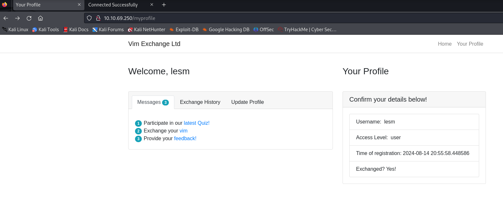
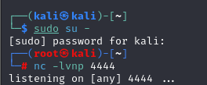
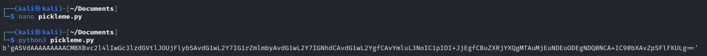
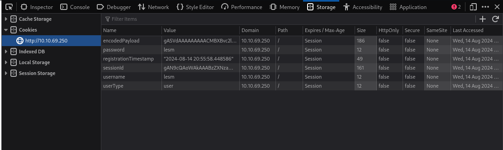
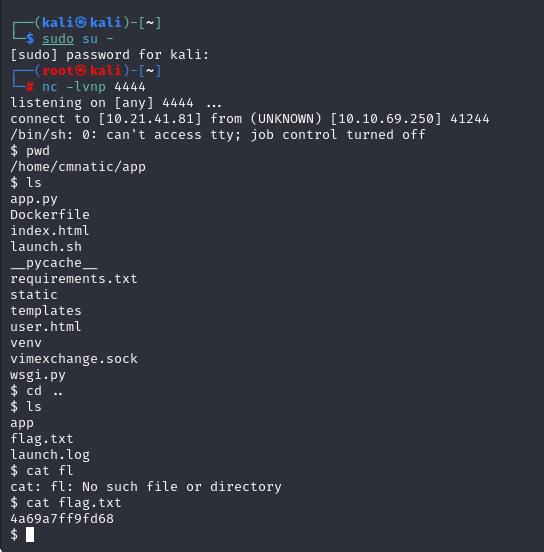

# [Severity 8] Insecure Deserialization - Code Execution
This technique is to modify the encryptedPaylod stored in the cookies to revser shell back to the attacker's VM. I think it's quite cool. <br>
 <br>

Create a netcat listening at 4444. <br>
 <br>

Change the `YOUR_TRYHACKME_IP` in `pickleme.py` to the real IP address, then execute `pickleme.py`.
```bash
python3 pickleme.py
```
Then you will have a long string as the output. Copy the string within speech marks (`'`) and pasted it to `encryptedPayload` value in the inspector (you can press F12 on the browser to have the panel). <br>
 <br>
 <br>
Refresh the page. Now, the netcat created the remote shell in the victim's VM. <br>
 <br>


# References
- [TryHackMe - OWASP API Security Top 10 - 1](https://tryhackme.com/r/room/owaspapisecuritytop105w)